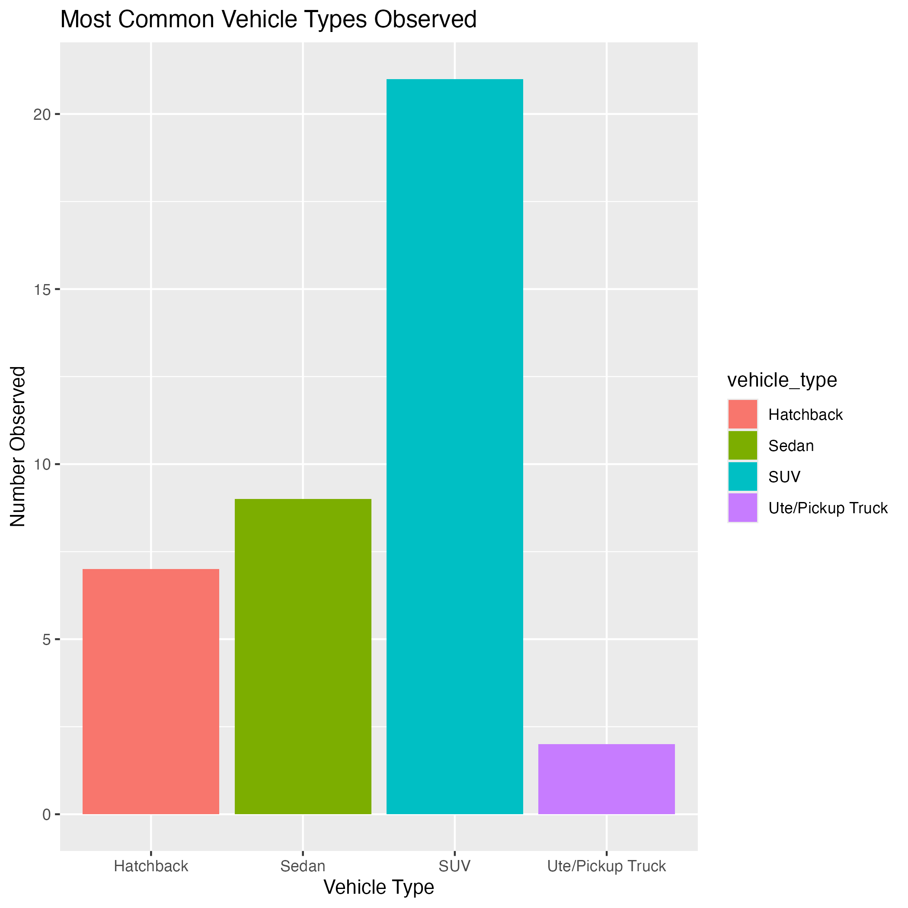
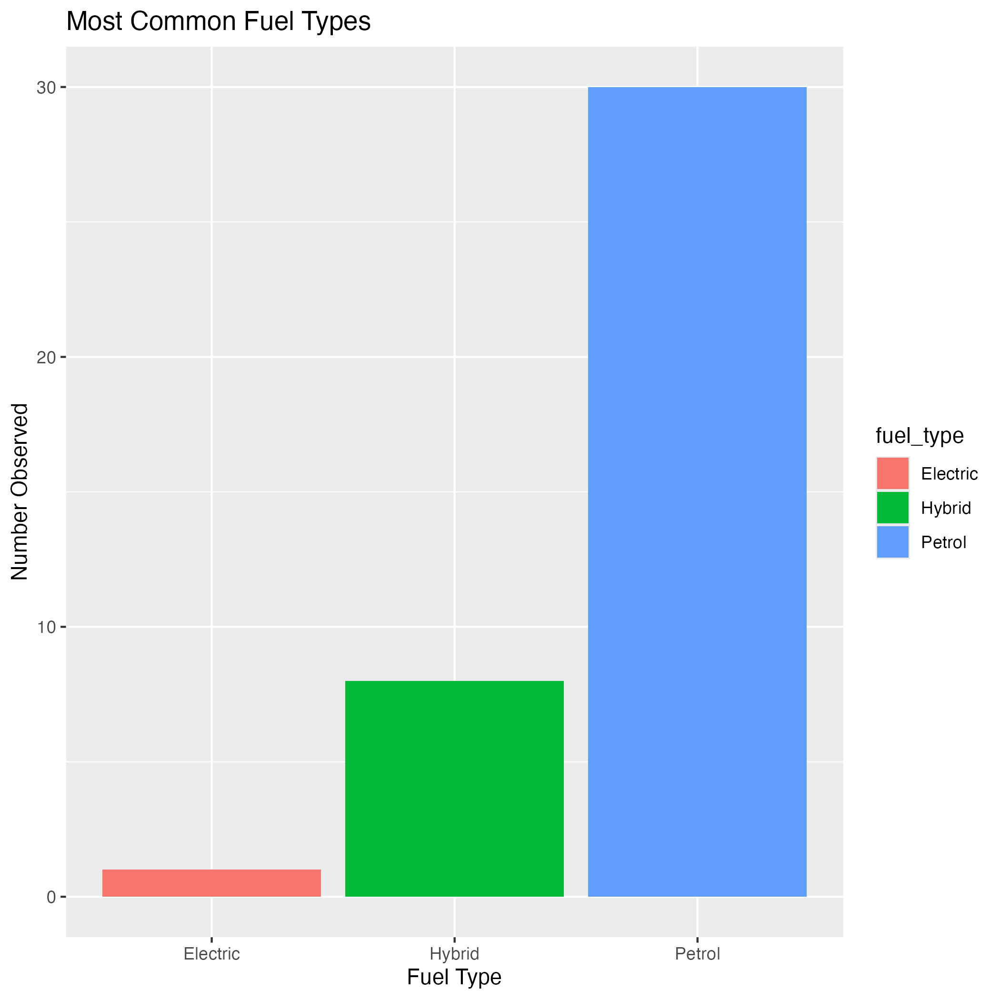
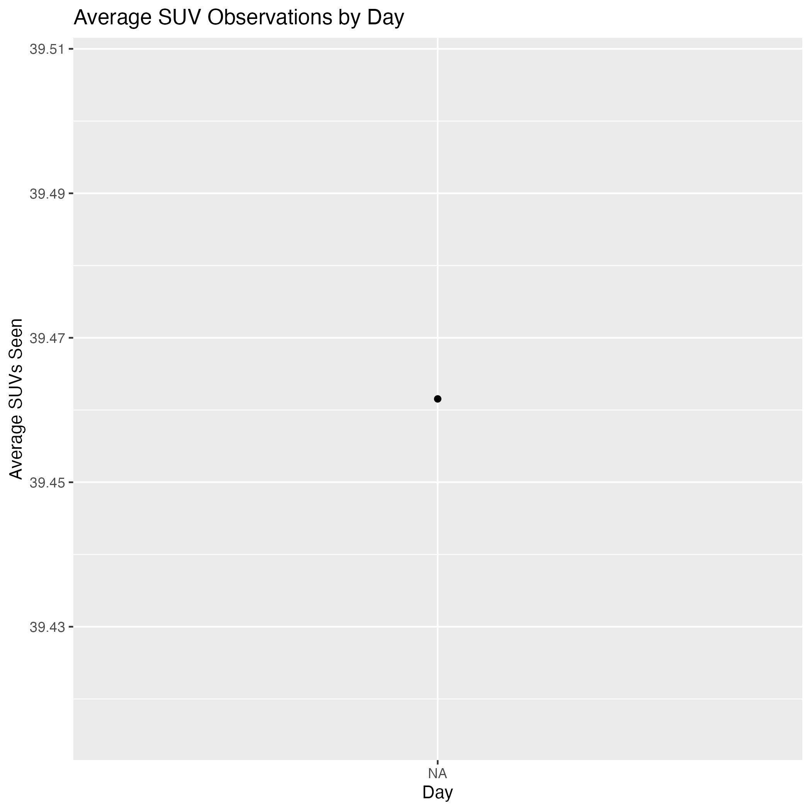

```{=html}
<script src="https://code.jquery.com/jquery-3.7.1.min.js" integrity="sha256-/JqT3SQfawRcv/BIHPThkBvs0OEvtFFmqPF/lYI/Cxo=" crossorigin="anonymous"></script>
```

```{r setup, include=FALSE}
knitr::opts_chunk$set(
  echo = FALSE,
  message = FALSE,
  warning = FALSE,
  error = FALSE
)
```

```{js}
$(function() {
  $(".level2").css('visibility', 'hidden');
  $(".level2").first().css('visibility', 'visible');
  $(".container-fluid").height($(".container-fluid").height() + 300);
  $(window).on('scroll', function() {
    $('h2').each(function() {
      var h2Top = $(this).offset().top - $(window).scrollTop();
      var windowHeight = $(window).height();

      if (h2Top >= 0 && h2Top <= windowHeight / 2) {
        $(this).parent('div').css('visibility', 'visible');
      } else if (h2Top > windowHeight / 2) {
        $(this).parent('div').css('visibility', 'hidden');
      }
    });
  });
})
```

```{css echo=FALSE}
body {
  background-color: #1f1f1f;
  color: white;
  font-family: Arial, sans-serif;
  line-height: 1.7;
}

h1 {
  color: #66ccff;
  text-align: center;
  margin-bottom: 40px;
}

h2 {
  color: #66ccff;
  border-bottom: 2px solid #66ccff;
  padding-bottom: 10px;
  margin-top: 60px;
}

img {
  border-radius: 10px;
}

.figcaption {
  display: none;
}
```

## What's going on with this data?

This visual data story explores the types of vehicles I have personally come across during my transits to The University of Auckland. The data was collected through observational logging over multiple days and records information about vehicle type, fuel type, car brands, and the number of SUVs seen during each journey.

The aim of this project is to identify patterns in Auckland commuting traffic and investigate whether larger vehicles such as SUVs dominate the roads around the university.



SUV's and sedans were the most frequently observed vehicle types during trips to university. This may suggest that Auckland commuters priorities practicality, passenger space, and comfort during daily travel.

## Petrol vehicles still dominate Auckland traffic



Petrol vehicles remained the most commonly observed fuel type throughout the data collection process. However, hybrid and electric vehicles were still regularly observed, suggesting that more environmentally friendly transport options are becoming increasingly visible on Auckland roads.

The gradual increase in hybrid and electric vehicles may reflect changing attitudes toward fuel efficiency and sustainability.

## SUV observations changed across different days



This visualisation uses timestamp data collected automatically through Google Forms. The timestamp variable was converted into date values using functions from the {lubridate} package.

The graph shows that SUV observations varied across different days of data collection. Certain days showed noticeably higher SUV averages, which may reflect differences in traffic volume, commuting behaviour, or observation timing.

## Conclusion

Overall, the data suggests that SUV's and petrol vehicles currently dominate the commuting environment around the University of Auckland. However, the presence of hybrid and electric vehicles indicates that Auckland traffic patterns may gradually shift toward more sustainable transportation options in the future.
